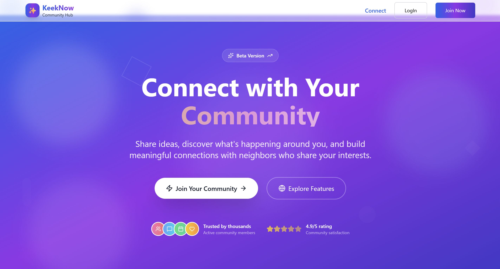

# Keeknow

A modern social media platform built with Node.js, Express, and MongoDB that allows users to create accounts, share posts, and interact with content.

### 🌐 Live Preview

---

**[🚀 Try it live!](https://keeknow.up.railway.app)**




---

## 🚀 Features

- **User Authentication**: Secure signup and login with JWT tokens
- **User Profiles**: Personal user profiles with customizable information
- **Post Creation**: Create and share posts with rich content
- **Social Interactions**: Like and comment on posts
- **Content Management**: Edit posts with version history
- **Privacy Controls**: Set post visibility (public, private, friends)
- **Media Support**: Upload images with captions
- **Tagging System**: Organize content with hashtags
- **Responsive Design**: Modern UI built with EJS templates

## 🛠️ Tech Stack

- **Backend**: Node.js, Express.js
- **Database**: MongoDB with Mongoose ODM
- **Authentication**: JWT (JSON Web Tokens) + bcrypt
- **Template Engine**: EJS
- **Session Management**: Cookie-based authentication

## 📋 Prerequisites

Before running this application, make sure you have the following installed:

- [Node.js](https://nodejs.org/) (v14 or higher)
- [MongoDB](https://www.mongodb.com/try/download/community) (v4.4 or higher)
- [npm](https://www.npmjs.com/) or [yarn](https://yarnpkg.com/)

## 🚀 Installation

1. **Clone the repository**
   ```bash
   git clone https://github.com/bytescom/keeknow.git
   cd keeknow
   ```

2. **Install dependencies**
   ```bash
   npm install
   ```

3. **Environment Setup**
   Create a `.env` file in the root directory with the following variables:
   ```env
   MONGO_URI=mongodb_url_here
   JWT_SECRET=your_jwt_secret_key_here
   ```

4. **Database Setup**
   - Start MongoDB service
   - The application will automatically create the database and collections

5. **Run the application**
   ```bash
   npm start
   ```

   The application will be available at `http://localhost:3001`

## 📁 Project Structure

```
keeknow/
├── app.js              # Main application file
├── package.json        # Project dependencies and scripts
├── config/             # Configuration files
├── models/             # Database models
│   ├── User.js        # User schema and model
│   └── Post.js        # Post schema and model
└── views/              # EJS template files
    ├── dashboard.ejs   # User dashboard
    ├── index.ejs       # Landing page
    ├── login.ejs       # Login form
    └── signup.ejs      # Registration form
```

## 🔧 API Endpoints

### Authentication
- `GET /signup` - Display signup form
- `POST /signup` - User registration
- `GET /login` - Display login form
- `POST /login` - User authentication
- `POST /logout` - User logout

### User Dashboard
- `GET /dashboard` - User dashboard (requires authentication)
- `POST /post` - Create new post (requires authentication)

## 🗄️ Database Models

### User Model
- `name`: User's full name
- `username`: Unique username
- `email`: Unique email address
- `password`: Hashed password
- `posts`: Array of post references

### Post Model
- `user`: Reference to user who created the post
- `content`: Post content (max 2000 characters)
- `likes`: Array of user references who liked the post
- `comments`: Array of comment objects with user references and content
- `images`: Array of image objects with URLs and captions
- `tags`: Array of hashtags
- `visibility`: Post visibility setting (public/private/friends)
- `isEdited`: Boolean indicating if post was edited
- `editHistory`: Array of previous versions
- `timestamps`: Automatic creation and update timestamps

## 🔐 Security Features

- **Password Hashing**: Bcrypt with salt rounds
- **JWT Authentication**: Secure token-based sessions
- **Input Validation**: Request body validation and sanitization
- **Protected Routes**: Middleware-based authentication checks

## 🎨 Frontend Features

- **Responsive Design**: Mobile-friendly interface
- **Template Engine**: EJS for dynamic content rendering
- **Form Handling**: Client-side and server-side validation
- **User Experience**: Intuitive navigation and feedback

## 🚀 Getting Started

1. **Visit the application**: Navigate to `http://localhost:3001`
2. **Create an account**: Use the signup form to register
3. **Login**: Authenticate with your credentials
4. **Start posting**: Create your first post from the dashboard
5. **Interact**: Like and comment on posts

## 🤝 Contributing

1. Fork the repository
2. Create a feature branch (`git checkout -b feature/amazing-feature`)
3. Commit your changes (`git commit -m 'Add some amazing feature'`)
4. Push to the branch (`git push origin feature/amazing-feature`)
5. Open a Pull Request

## 📝 License

This project is licensed under the ISC License.

## 🐛 Issues

If you encounter any issues, please report them on the [GitHub Issues page](https://github.com/bytescom/keeknow/issues).

## 📞 Support

For support and questions, please open an issue on GitHub or contact the development team.

**Contact Email**: [pankajk07414@gmail.com](mailto:pankajk07414@gmail.com)

**Developer**: Pankaj Kumar  
**Email**: [pankajk07414@gmail.com](mailto:pankajk07414@gmail.com)

---

**Built with ❤️ by bytescom**
